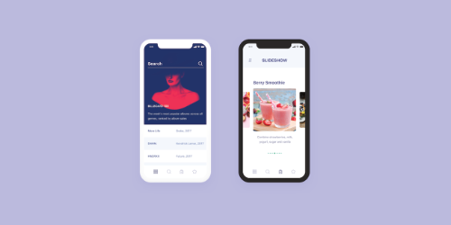

# Week 2: User Interface Design

## From requirements to design
From a set of requirements, we can end up with a range of different designs. We can use **sketches**, **wireframes**, **prototypes** and **mockups** to design the final product.

- **Sketches** are exactly what the name says, usually done with pen and paper and form the very basic ideas of what the customer wants.
- **Wireframes** show the structure of a app, containing the content and elements. It's similar to the blueprint of a building and consists of just lines (wires), as the name suggests.
- **Prototypes** are a high fidelity version of a wireframe, which is interactive and fits the final user interface as much as possible. Its purpose is to provide a complete user experience for the testers by simulating the real product interface and interaction.
- **Mockups** also contain the overall visual design of the product. It has richer visual elements than prototypes and wireframes, including graphics, layout, colour and possibly even animations. The mockup is essentially the final design of the product.

## Mockups
Mockups are essentially a replica of the final product. They are useful as you can confirm with your custom that it meets their requirements, show them a range of different design approaches and exchange ideas regarding design. By using a mockup, misunderstandings can be prevented and bugs could be removed earlier on. For example, if I said I want a hamburger menu on the home screen with options X, Y and Z, how many ways could you design this? The benefits of having mockups are so that we don't waste time changing designs during development, as it is much easier to change a graphically produced design.

  

## Ben Shneiderman's 8 Golden Rules

1. **Strive for consistency** - utilise familiar icons, colours and structures when designing similar sitautations. By having a consistent user interface, users are able to apply knowledge from one click to another, rather than having to learn new representations of the same actions.

2. **Seek universal usability** - does your application look the same across different devices? Are the keyboard shortcuts similar across different operating systems?

3. **Offer informative feedback** - for example, when displaying an error message, tell the user what error has occured and what step they should take. If elements can be interacted with, you could highlight the element so tell the user they have selected such element.

4. **Design dialogues that yield closure** - tell users what their actions has led them to, rather than keeping them guessing. For example, present a "Booking Confirmed" message and a booking confirmation when they complete a booking.

5. **Prevent errors** - provide simple error checks, such as flagging text fields where the input is invalid, rather than waiting for the user to submit the form then telling them they're wrong. When unavoidable errors occur, ensure users are provided with intuitive step-by-step instructions of how to proceed.

6. **Permit easy reversal of actions** - provide users obvious ways to reverse their actions, whether it is updating a data entry or a sequence of actions. As Shneiderman describes in his book:
  > This feature relieves anxiety, since the user knows that errors can be undone; it thus encourages exploration of unfamiliar options.

7. **Keep users in control** - let users be the initiators of actions and give them the sense that they are in full control of events occuring. For example, give users the choice of which email newsletters they wish to subscribe to.

8. **Reduce short-term memory load** - humans attention is limited and we are only capable of maintaining around five items in our short-term memory at once. User interfaces should be as simple as possible, favouring recognition over recall.